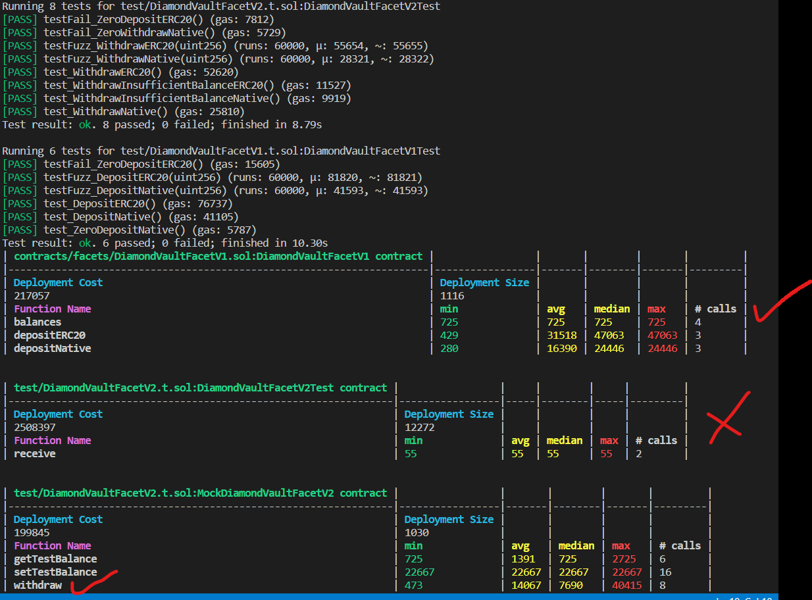
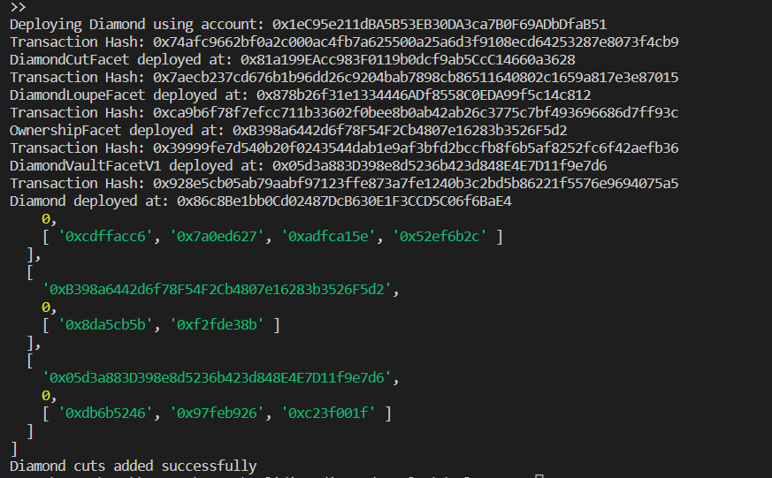
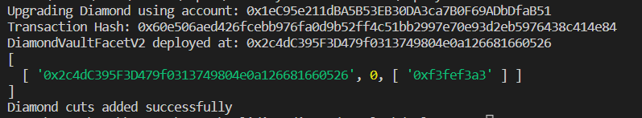
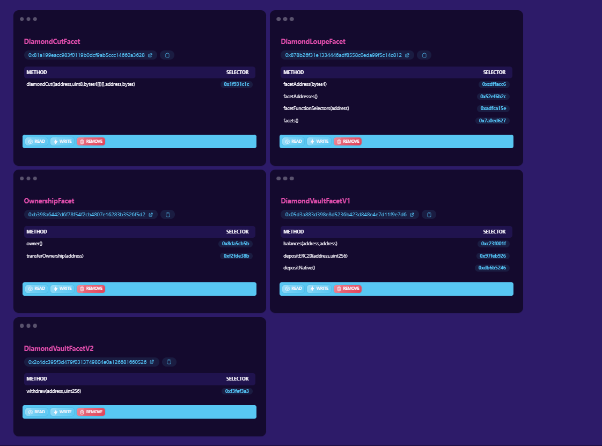
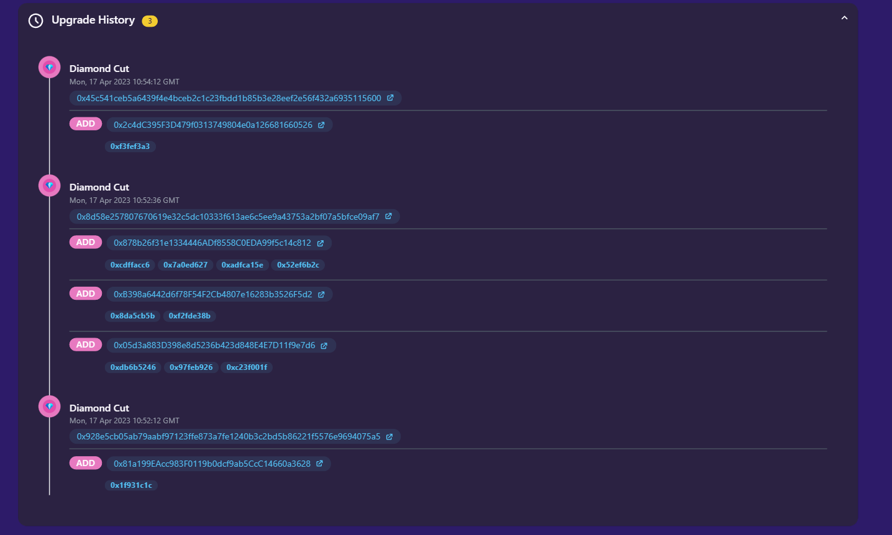

# vault-using-diamonds

This project provides a vault implementation for deposits and withdrawals using the EIP-2535 Diamond Standard. For more information about the Diamond Standard and other implementations, visit: https://github.com/mudgen/diamond

### Overview
This implementation is based on the diamond-3-hardhat repository, which can be found here: https://github.com/mudgen/diamond-3-hardhat

Key choices made in this project include:

- **Implementation**: diamond-3
- **Storage**: AppStorage
- **Framework**: Foundry, ts-node


### Why diamond-3?

The diamond-3 implementation was chosen for the following reasons:
1. Multiple projects using diamond-3 have received good audit scores. For reference, see the audit reports here: https://github.com/mudgen/awesome-diamonds
2. Diamond-3 offers lower gas usage for calling diamond loupe functions, making it more convenient for integration with other smart contracts. For more information, visit: https://github.com/mudgen/diamond


### Installation
Follow these steps to install the project:

```
git clone https://github.com/nftstonkers/solidity-diamond-vaults
```

Install the Foundry framework:

```
https://book.getfoundry.sh/getting-started/installation
```

Build the code (use --force to clean build):

```
cd solidity-diamond-vaults
forge build --force
```

### Testing:

```
forge test -vvv --gas-reports
```

#### Test Report

Important Note - Only Relevant Function in MockDiamondVaultFacetV2 is withdraw


### Deployment:

To deploy the smart contracts, follow these steps:
```
cd deployment
npm install
```

Create a .env file and add the following content:

```
RPC_ENDPOINT={{RPC ENDPOINT}}
CHAIN_ID={{CHAIN_ID}}
SECRET_NEUMONIC={{NEUMONIC USED TO DERIVE PRIVATE KEY}}
DIAMOND_ADDRESS={{DIAMOND ADDRESS}} //only needed in upgrade script
```

Run the deployment script:
```
npx ts-node deploy-diamond.ts
```


#### Deployment Order
The deployment script will deploy the following contracts in order:

1. DiamondCutFacet
2. DiamondLoupeFacet
3. OwnershipFacet
4. DiamondVaultFacetV1
5. Diamond (with owner address of diamond and DiamondCutFacet address as param)
6. Diamond Upgrade (Adds functions of all deployed facets using DiamondCut to the diamond contract)


### Upgrading to V2:

To upgrade the smart contracts to V2, follow these steps:

```
cd deployment
npm install //optional
```
Run the upgrade script:
```
npx ts-node upgrade-v2.ts
```  



#### Upgrade Order

The upgrade script will deploy the following contracts in order:
1. DiamondVaultFacetV2
2. Diamond Upgrade (Withdraw Function of DiamondVaultFacetV2 is added using DiamondCut)


### Verifying Smart Contracts on Etherscan:

```
forge verify-contract --chain {{CHAIN_ID}} --num-of-optimizations 200 -e {{ETHERSCAN_API_KEY}} --compiler-version "0.8.17+commit.8df45f5f" {{RELEVANT_CONTRACT}} {{CONTRACT_PATH_WITH_SOL_FILE}}:{{CONTRACT_NAME}}
```

### Deliverables:

#### Deployed Contracts

- [DiamondCutFacet](https://sepolia.etherscan.io//address/0x81a199eacc983f0119b0dcf9ab5ccc14660a3628)
- [DiamondLoupeFacet](https://sepolia.etherscan.io//address/0x878b26f31e1334446adf8558c0eda99f5c14c812)
- [OwnerswhipFacet](https://sepolia.etherscan.io//address/0xb398a6442d6f78f54f2cb4807e16283b3526f5d2)
- [DiamondVaultFacetV1](https://sepolia.etherscan.io//address/0x05d3a883d398e8d5236b423d848e4e7d11f9e7d6)
- [DiamondVaultFacetV2](https://sepolia.etherscan.io//address/0x2c4dc395f3d479f0313749804e0a126681660526)
- [Diamond](https://sepolia.etherscan.io//address/0x86c8Be1bb0Cd02487DcB630E1F3CCD5C06f6BaE4)

### Verify on Louper.dev
https://louper.dev/diamond/0x86c8Be1bb0Cd02487DcB630E1F3CCD5C06f6BaE4?network=sepolia


### Proof of Facets
Can be verified using Louper.dev. Screenshot for reference



### History of Contract Updates
Can be verified using Louper.dev. Screenshot for reference



### Deposit and Withdrawal Transactions

#### Note - Please make sure to approve some allowance to the diamomnd contract before testing depositERC20. Example of approval function can be found here -
[ERC20 Contract](https://sepolia.etherscan.io/token/0x779877a7b0d9e8603169ddbd7836e478b4624789?a=0x1ec95e211dba5b53eb30da3ca7b0f69adbdfab51#writeContract)

https://sepolia.etherscan.io/tx/0xac078527f2d5d6aae601150e7259f51335832ef8d367f6ddec12356d716e3ec3
https://sepolia.etherscan.io/tx/0x9e0e98e9f4e1567d4a21476baae5aa12fae748d7cca3e0a28cb5e16bcc7f55b7
https://sepolia.etherscan.io/tx/0x15fe4199d314ae79ac9217faee1216f65444a921fc501cfcea3cb6eaefc58e9c
https://sepolia.etherscan.io/tx/0xee8ba530f3bab0d2c75e4f471985584afb22ce3e8e837583b4d140c4dd251e0f
https://sepolia.etherscan.io/tx/0x531b6deb266fe5a17c93bb94480b6c0b93a9269a26fd7b20b7c51d0470f5a62c
https://sepolia.etherscan.io/tx/0xdd74ccd290fc2758e9d5f10c22c60e9bae2eb3935eec05d2f3ddbfa05fa4ffd5
https://sepolia.etherscan.io/tx/0xf505681014a3c8a03bc3ca084378d65492f2446d31747130e238f0d327e85310
https://sepolia.etherscan.io/tx/0x0fa214d6e2bc763e0f6b0b38d52ccde6aee9c2ee6dba4958aa02bd7bfd8751d5

### License

This project is licensed under the MIT License.

### Support and Contact

If you have any questions, issues, or suggestions, please feel free to open an issue or contact the maintainer directly:

**Maintainer**: Manas G  
**Twitter**: @WhatManaThinks  
**GitHub**: https://github.com/nftstonkers