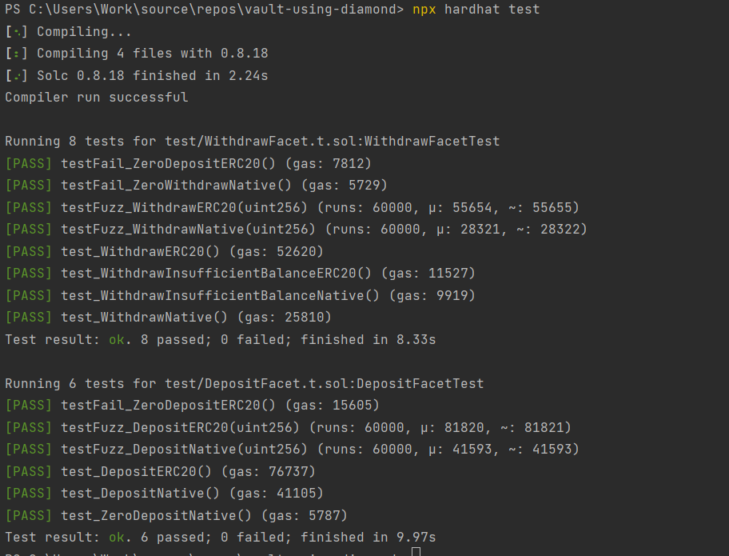

# vault-using-diamonds

This project provides a vault implementation for deposits and withdrawals using the EIP-2535 Diamond Standard. For more information about the Diamond Standard and other implementations, visit: https://github.com/mudgen/diamond

### Overview
This implementation is based on the diamond-3-hardhat repository, which can be found here: https://github.com/mudgen/diamond-3-hardhat

Key choices made in this project include:

- **Implementation**: diamond-3
- **Storage**: AppStorage
- **Framework**: Hardhat, Foundry (as testing framework), ts-node


### Why diamond-3 pattern instead of first two?

The diamond-3 implementation was chosen for the following reasons:
1. Multiple projects using diamond-3 have received good audit scores. For reference, see the audit reports here: https://github.com/mudgen/awesome-diamonds
2. Diamond-3 offers lower gas usage for calling diamond loupe functions, making it more convenient for integration with other smart contracts. For more information, visit: https://github.com/mudgen/diamond


### Installation
Follow these steps to install the project:

```
https://github.com/nftstonkers/vault-using-diamond/
```

Checkout to v1 branch:

```
git checkout v1
```


Install the hardhat project and related dependencies:

```
npm i
```

Install the Foundry framework:

```
https://book.getfoundry.sh/getting-started/installation
```

### Compile Contracts:

```
npx hardhat compile
```


### Testing:

```
npx hardhat test
```

#### Test Report



### Deployment:

Create a .env file and add the following variables as requested in .env-template file:

```
SEPOLIA_RPC_URL=
PRIVATE_KEY=
MUMBAI_RPC_URL=
POLYSCAN_API_KEY=
ETHERSCAN_API_KEY=
DIAMOND_ADDRESS=  //only needed in upgrade script
```

To deploy on hardhat env, 
```
npx hardhat deploy --tags diamond
```

To deploy on Sepolia or Mumbai network use below commands:
```
npx hardhat deploy --network sepolia --tags diamond
npx hardhat deploy --network mumbai --tags diamond
```

**Note** - Deployment also ensures that contracts are verified

#### Deployment Order
The deployment script will deploy the following contracts in order:

1. DiamondCutFacet
2. DiamondLoupeFacet
3. OwnershipFacet
4. DepositFacet
5. Diamond (with owner address of diamond and DiamondCutFacet address as param)
6. Diamond Upgrade (Adds functions of all deployed facets using DiamondCut to the diamond contract)

### Upgrading Contract:

To upgrade the contract and add withdraw functionality, follow the below steps
```
Add DIAMOND_ADDRESS value in env file
```

Run the upgrade script:
```
npx hardhat deploy --tags upgrade
npx hardhat deploy --network sepolia --tags upgrade
npx hardhat deploy --network mumbai --tags upgrade
``` 

#### Upgrade Order

The upgrade script will deploy the following contracts in order:
1. WithdrawFacet
2. Diamond Upgrade (Withdraw Function of WithdrawFacet is added using DiamondCut)


### Verifying Smart Contracts on Etherscan:

```
Contracts are automatically verified while deploying 
```

### Deliverables:

#### Deployed Contracts

- [DiamondCutFacet](https://mumbai.polygonscan.com//address/0xb7d505b74f273bf034e6e37180eb7b70c6edc7af)
- [DiamondLoupeFacet](https://mumbai.polygonscan.com//address/0x63d018e986c0c5bf2e4ce2d024ded80646b221d8)
- [OwnerswhipFacet](https://mumbai.polygonscan.com//address/0x2e25e51a8f98a8c463b41ac5bcefbd37f0e18792)
- [DepositFacet](https://mumbai.polygonscan.com//address/0xc14695e326cd62b13f684781aa010153efb866a7)
- [WithdrawFacet](https://mumbai.polygonscan.com//address/0x8a0015d8843f5514b451feba6fda58209f54865a)
- [Diamond](https://mumbai.polygonscan.com//address/0x13f27C2607358020224089b336f3291e6450906d)

### Verify on Louper.dev
https://louper.dev/diamond/0x13f27C2607358020224089b336f3291e6450906d?network=mumbai


#### Note - Please make sure to approve some allowance to the diamond contract before testing depositERC20. Example of approval function can be found here -

### License

This project is licensed under the MIT License.

### Support and Contact

If you have any questions, issues, or suggestions, please feel free to open an issue or contact the maintainer directly:

**Maintainer**: Manas G  
**Twitter**: @WhatManaThinks  
**GitHub**: https://github.com/nftstonkers